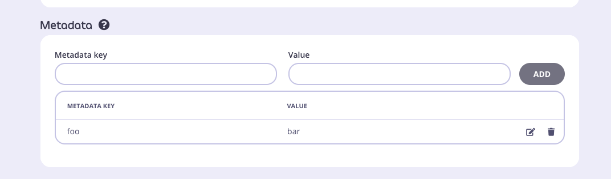

# Inject Meta data

Injects Meta data from a key into a Header.

## Add Plugin

Compile plugin and deploy to Gateway

```
"post": [
        {
          "disabled": false,
          "name": "InjectMetadata",
          "path": "/opt/tyk-gateway/middleware/CustomGoPlugin.so",
          "require_session": false,
          "raw_body_only": false
        }
      ],
```


## Create Key
Create a key, add a meta data value to it: 


Then inject it as a header:

```
metaData := session.MetaData
		foo, ok := metaData["foo"].(string) // Type assert foo to string
		if !ok {
			// Handle the case where foo is not a string or foo does not exist
			logger.Error("Error: 'foo' is not a string or not found in metaData")
			return // or continue, depending on your error handling strategy
		}
		// Process metaData as needed
		r.Header.Add("X-Plugin-Inject", foo)
```


Note - the API must be protected (not keyless/open) for Keys (Sessions) to be identified & usable.