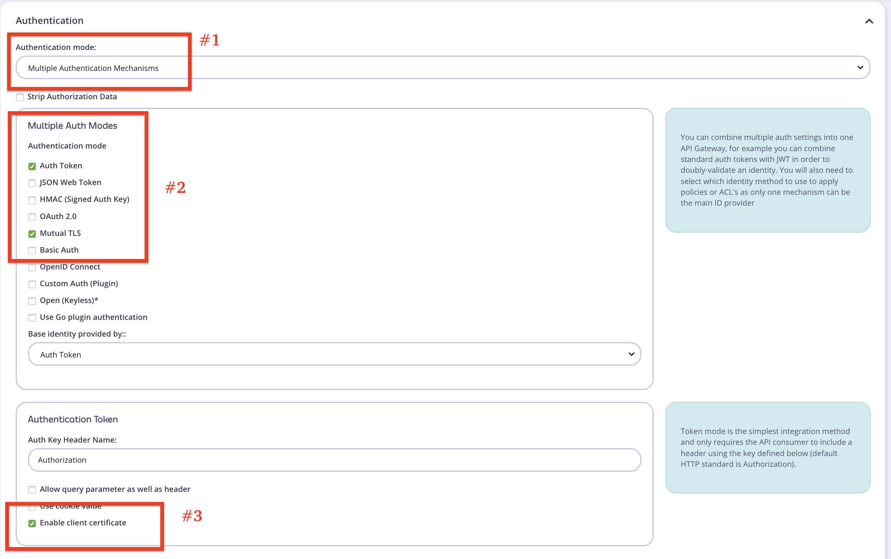

### How to Protect an API with Auth Token & MTLS

Our goal:

-- protect an API with Tyk using both Auth Tokens & mTLS

-- Allow our developers to upload their client certs through the Developer Portal

## Setup Instructions

1) Set up an API with multiple auth types selected and select auth token + mtls, base identity provided by Auth Token **OR** [Import the API "api-definition.json" ](api-definition.json)



2) Add the [Javascript plugin](pre-auth-check.js) to the local filesystem.  
The plugin runs in the "pre" phase, verifying the requests before they reach the authentication stage.  This forces users to include an "Authorization" header as well as the client cert.
https://tyk.io/docs/getting-started/key-concepts/middleware-execution-order/


A) Make sure you define the relative path (to the Gateway binary) in the API Definition.  

B) Make sure your JSVM is enabled in `tyk.conf` `"enable_jsvm": true`

3) Publish this API via Policy to the API Catalogue  [(Instructions)](https://tyk.io/docs/try-out-tyk/tutorials/create-security-policy/)

4) In Dashboard Portal Management -> settings, select "Enable subscribing to multiple APIs with single key.
**This is very important - This will allow you to upload certs in a multi-auth API**


#### Try it out

Go to the Developer portal, hit "request a key" on this API.  Upload your `cert.pem` (public Key).

Then try it out:
```
$ curl -k https://localhost:8081/mtls-auth-api/get --cert cert.pem --key key.pem
{
    "error": "Must Use Auth Token & Cert"
}

$ curl -k https://localhost:8081/mtls-auth-api/get --header "Authorization: eyJ..."
{
    "error": "Client TLS certificate is required"
}

$ curl -k https://localhost:8081/mtls-auth-api/get --header "Authorization: eyJ..." --cert cert.pem --key key.pem
{
  "hello": "world"
}
```

